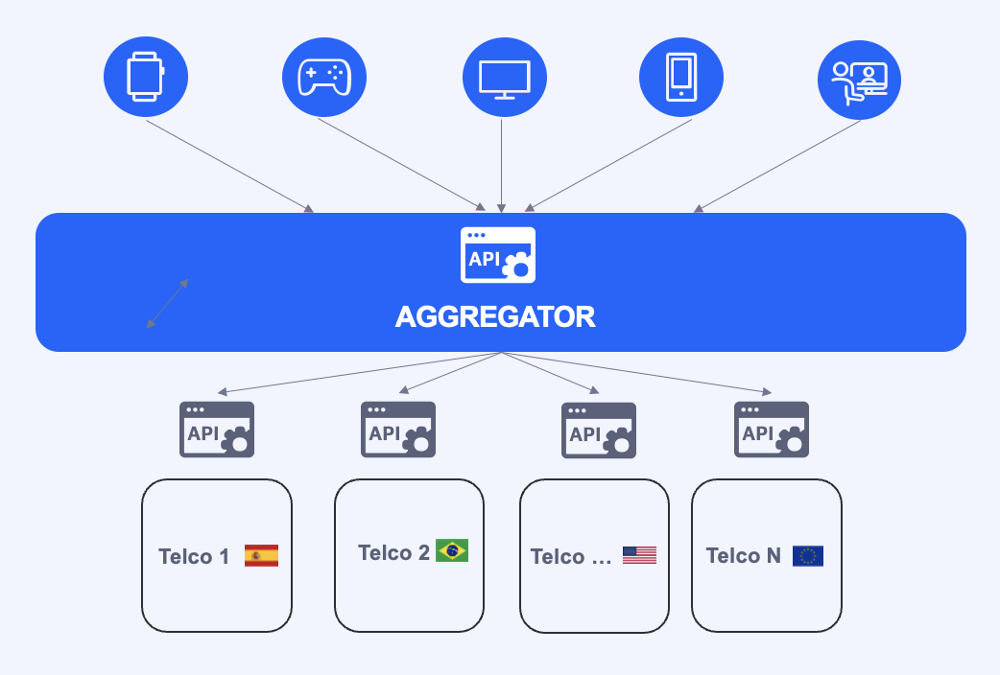

## Introduction to Open Gateway API Architecture

The Open Gateway APIs manages API calls and credentials, ensuring they are routed correctly to respective mobile operators. Its intuitive interface enables developers to effortlessly choose and subscribe to network APIs offered by multiple operators across different regions. This transforms Open Gateway into a convenient marketplace that simplifies procurement processes while maintaining a seamless user experience.

 Open Gateway Architecture

## Key Features of Open Gateway API Architecture

### Interoperability and Open Standards

The Open Gateway APIs are built on **open standards**, ensuring interoperability between different telecommunications operators, aggregators, cloud providers, and telcos. This approach simplifies the integration process and guarantees consistent functionality across various mobile networks, including 4G, 5G, and future technologies.

### RESTful API Design

The Open Gateway APIs are designed using a **RESTful (Representational State Transfer) architecture**, which enables efficient and straightforward communication between clients and servers. By utilizing standard HTTP methods such as GET, POST, PUT, and DELETE, this architecture supports:

- **High Scalability:** Ideal for distributed and high-performance environments.
- **Ease of Implementation:** Simplifies the development process for integrating network capabilities.
- **Flexibility:** Adaptable to a wide range of applications and services.

### Robust Security and Authentication

Security is a top priority in the Open Gateway architecture. The APIs implement **robust security and authentication mechanisms** to protect data integrity and confidentiality. Key security features include:

- **OAuth 2.0:** For secure authorization. 
- **JSON Web Tokens (JWT):** For safe and reliable authentication.

### Unified API Access

The Open Gateway architecture offers **Unified API Access**, allowing developers to connect to multiple carriers' network capabilities through a single, standardized interface. This feature:

- **Simplifies Integration:** Reduces complexity by providing a unified access point.
- **Enhances Efficiency:** Streamlines the process of accessing and utilizing network services.

## How to consume the APIs

To interact with the Open Gateway APIs, developers will interface with them through an **aggregator** or a **channel partner**. Aggregators serve as intermediaries that consolidate APIs from multiple telecommunications operators into a unified platform. This documentation outlines how developers can leverage aggregators to access and integrate Open Gateway APIs seamlessly.

An **aggregator** in telecommunications and APIs refers to a pivotal entity that consolidates services and functionalities from multiple providers into a unified platform or interface. This consolidation simplifies access to diverse offerings for end-users, developers, or businesses, enhancing efficiency and fostering innovation within the digital ecosystem.

You can also test our Open Gateway APIs by joining to our [Developer Hub](https://opengateway.telefonica.com/developer-hub) and using the Sandbox.
