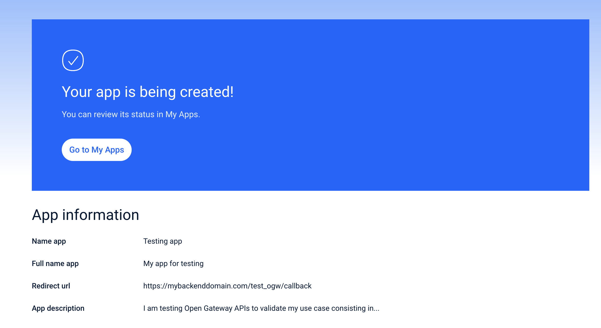

# Telefónica Open Gateway Sandbox

In this section you will find how to use our Sandbox environment to test the Open Gateway APIs without the need to subscribe to a Channel Partner. Your tests won't be charged and won't be suitable for going into a production stage, so it is a great chance to learn and prototype, as a previous step to go commercial.

Please note that the usage of credentials granted from our Sandbox might be subject to some limitations in order to let you test without the obligations of a commercial contract. The terms and conditions of our developer or partner programs will apply.

## Getting onboarded

The only requirement to start using the Open Gateway Sandbox is to join one of our programs. Please check which one best fit your needs. You can also request to join both:

- [Open Gateway Developer Hub](https://opengateway.telefonica.com/en/developer-hub)
- [Open Gateway Partner Program](https://opengateway.telefonica.com/en/partner-program)

Once you are approved in at least one of our programs and you log in to the private area of the Telefónica Open Gateway website, you already have access to the Sandbox web console as a program member from the Technical Toolbox section.

## Registering your application

Open Gateway APIs access is granted to applications, not developers, so every application can have limited access to the scope and for the purpose it needs.

[More information on Privacy](../../opengateway/privacy.md)

Therefore the way to get credentials to test the APIs is to register an application in the Sandbox console. You will use your application credentials to authenticate your requests to the APIs from any test you code no matter if it is actually a comprehensive application or just a tiny script to run from the a command line interface.

For every application you create, you will need to follow these simple steps to configure it:

1. Select the APIs you want your application to test. It could be one or several APIs depending on your use case.

2. Select the usage mode for your application. You have the following options:

	- **Production mode**

		Although our Sandbox is not a Channel Partner's production environment but a testing environment instead, it can route your API calls to our mobile operators to provide a real response if you test your prototype application from a device connected to one of their networks. That requires that you are the mobile line holder and have the SIM card installed in such device.

		Movistar (Spain) is already available for testing from the Telefónica Open Gateway Sandbox, and other Telefónica operators in other countries will be added soon.

		The production mode is disabled by default for Privacy reasons, but you can enable it by filling in your legal information and accepting the terms and conditions in the form that the Sandbox console will offer you for that purpose. You will have to provide some mobile phone numbers of your own which will be added to a whitelist that will allow you to test the APIs in production mode from your own devices and will block API usage accessing someone else's personal data.

	- **Mock mode**

		You can test your application without the need to have a SIM card from one of our mobile operators. The Sandbox will provide you with a mock response for every API call you make.

		The mock mode will also make available for you some APIs that are not still commercially available on our mobile operators, so you can test them in advance.

3. Briefly describe your application as part of the application onboarding process so that mobile operators can understand the purpose of your tests and validate it.

	Since it is a testing environment, your application won't be rejected as per this information, but our Sandbox uses standard procedures to register applications in the mobile operators' systems which takes this data as mandatory.

	These are the fields you need to fill in:

	- **Name**: A name to identify your application by the operators as an Open Gateway APIs consumer.
	- **Full name**: Your application's commercial name by which operators can find it in your website or application stores.
	- **Description**: A brief description of your application's use case related to the usage of the APIs.
	- **Redirect URL**: (Optional) For frontend triggered authorization flows, you must indicate an URI hosted on your servers for the flow to call back to your code for it to complete authorization and perform the service API request (check [frontend triggered authorization flow](/authentication/frontend.md) for detailed information).

4. Check the specifications and accept the terms and conditions per API and operator.

	Each mobile operator has its own terms and conditions for the usage of each API, and its own technical specifications you will want to consider when it comes to consuming them, so you will need to accept them for each API you want to test on each operator you have previously selected.

	Since our Sandbox is just a free testing environment, specifications are not binding and conditions are meant for safeguarding privacy, even given that only whitelisted phone numbers can be used when testing in the Production mode with our mobile operators. In the case of the Mock mode, a global simulated operator will provide you with mock responses being the terms and conditions of the program you are member to that applies.

5. Review the summary and confirm

6. Once you have confirmed, your application is granted access to the Sandbox API gateway with its credentials.

To get your application credentials and use them in your prototype, go to the application details page on the My Apps section, where you will find the following information:

- **Client ID**: A unique identifier for your application.
- **Client Secret**: A secret key to authenticate your application to the APIs.

Note that if you selected the Production mode, you will have to wait for the approval of your application by the mobile operators you selected. When your application status is "Completed" you are good to test the APIs with your applications's credentials no matter what end-user phone number you are using. If you only selected the Mock mode, you can start testing right away.

## Using the APIs

So far you have used the Sandbox console to register your application as the client to the APIs which means your application is the entity granted access with its credentials.

Now you will use such credentials to effectively consume de APIs from your code. You can use any programming language and any platform that supports HTTP requests, or you can use SDKs for convenience. The offering of SDKs in different programming languages depends on your Channel Partner of choice at the commercial stage. For testing purposes, our Open Gateway Sandbox provides you with a Python SDK and will publish SDK in other common languages soon.

### HTTP integration

#### Pros and cons
- Pros:
	- No dependencies on third-party libraries
	- No need to learn a new SDK
	- Portability across different Channel Partners (which provide their own SDKs)
- Cons:
	- More low-level tasks to care about: encoding your credentials, calling authorization endpoints, handling tokens, etc.
	- More difficult to implement
	- More verbose code
	- More error-prone code

#### API reference

### Sandbox SDK

#### Pros and cons
- Pros:
	- Low-level tasks are abstracted: you instantiate a class with your application credentials and the instance will handle authentication and token management for you
	- Further features could be included by the Channel Partner in the SDK: for instance, frontend SDKs handling network interfaces to avoid authentication problems caused by end-user device being connected to Wi-Fi networks
	- Less code to write
	- Less error-prone code
	- Easier to implement

#### SDK reference
