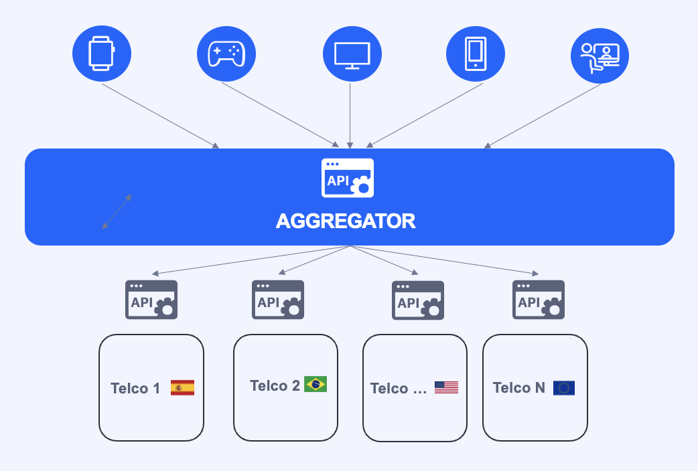

# Open Gateway API Architecture Documentation

## Introduction to Open Gateway API Architecture

The **Open Gateway API Architecture** is a cutting-edge framework designed to enable seamless integration of advanced network capabilities and services into your applications. Developed by the GSMA in collaboration with leading telecommunications operators, aggregators, cloud providers, and other telcos, this architecture focuses on promoting interoperability, enhancing innovation, and improving operational efficiency. By leveraging standardized APIs, the Open Gateway architecture empowers developers to create robust, scalable, and high-performance applications.

The Open Gateway APIs manages API calls and credentials, ensuring they are routed correctly to respective mobile operators. Its intuitive interface enables developers to effortlessly choose and subscribe to network APIs offered by multiple operators across different regions. This transforms Open Gateway into a convenient marketplace that simplifies procurement processes while maintaining a seamless user experience.

 Open Gateway Architecture

## Key Features of Open Gateway API Architecture

### Interoperability and Open Standards

The Open Gateway APIs are built on **open standards**, ensuring interoperability between different telecommunications operators, aggregators, cloud providers, and telcos. This approach simplifies the integration process and guarantees consistent functionality across various mobile networks, including 4G, 5G, and future technologies.

### RESTful API Design

The Open Gateway APIs are designed using a **RESTful (Representational State Transfer) architecture**, which enables efficient and straightforward communication between clients and servers. By utilizing standard HTTP methods such as GET, POST, PUT, and DELETE, this architecture supports:

- **High Scalability:** Ideal for distributed and high-performance environments.
- **Ease of Implementation:** Simplifies the development process for integrating network capabilities.
- **Flexibility:** Adaptable to a wide range of applications and services.

### Robust Security and Authentication

Security is a top priority in the Open Gateway architecture. The APIs implement **robust security and authentication mechanisms** to protect data integrity and confidentiality. Key security features include:

- **OAuth 2.0:** For secure authorization.
- **JSON Web Tokens (JWT):** For safe and reliable authentication.

### Unified API Access

The Open Gateway architecture offers **Unified API Access**, allowing developers to connect to multiple carriers' network capabilities through a single, standardized interface. This feature:

- **Simplifies Integration:** Reduces complexity by providing a unified access point.
- **Enhances Efficiency:** Streamlines the process of accessing and utilizing network services.

## Benefits of Open Gateway API Architecture

### Simplified Integration

By using standardized APIs, developers can quickly integrate advanced network capabilities into their applications. This approach eliminates the need for custom integrations for each operator, aggregator, or cloud provider, saving time and resources.

### Improved Scalability

The RESTful architecture of Open Gateway APIs supports high scalability, making it suitable for applications that require efficient handling of large volumes of data and users.

### Enhanced Security

The implementation of OAuth 2.0 and JWT ensures that user data and application interactions are secure, providing peace of mind for developers and end-users alike.

### Innovation and Flexibility

Open Gateway APIs enable developers to explore new opportunities and create innovative services that leverage advanced mobile network capabilities. The flexible and open nature of the architecture supports a wide range of use cases and applications.

## How to consume the APIs

To interact with the Open Gateway APIs, developers will interface with them through an **aggregator** or a **channel partner**. Aggregators serve as intermediaries that consolidate APIs from multiple telecommunications operators into a unified platform. This documentation outlines how developers can leverage aggregators to access and integrate Open Gateway APIs seamlessly.

An **aggregator** in telecommunications and APIs refers to a pivotal entity that consolidates services and functionalities from multiple providers into a unified platform or interface. This consolidation simplifies access to diverse offerings for end-users, developers, or businesses, enhancing efficiency and fostering innovation within the digital ecosystem.

Aggregators play a crucial role in telecommunications and API ecosystems by promoting interoperability, enhancing service accessibility, and driving innovation through consolidated access to diverse offerings.

### Key Characteristics of an Aggregator:

1. **Integration of Services:** Aggregators integrate APIs and services from various providers (telecom operators, cloud services, etc.) into a unified platform, offering seamless access and management.
   
2. **Unified Interface:** They provide a single, user-friendly interface where users can access and manage multiple services without the need for separate integrations for each provider.

3. **Value Addition:** Aggregators often enhance services by adding additional features, optimizing user experiences, or providing value-added functionalities through their consolidated platform.

4. **Streamlined Access:** Simplifying the process of accessing and using complex services, aggregators facilitate easier integration of diverse functionalities into applications or solutions.

### Steps to Use Open Gateway APIs through an Aggregator

1. **Discover Available Aggregators**

   Begin by researching aggregators that offer integration with Open Gateway APIs. Look for aggregators that support the specific services and functionalities you require for your application.

2. **Register and Obtain Credentials**

   Once you've selected an aggregator, register for an account and obtain the necessary credentials to access their platform and APIs. This typically includes API keys, OAuth tokens, or other authentication mechanisms provided by the aggregator.

3. **Explore API Documentation**

   Refer to the aggregator's documentation to understand how to interact with their platform and access Open Gateway APIs. Familiarize yourself with endpoints, request/response formats, authentication methods, and any specific requirements for using Open Gateway services.

4. **Implement API Integration**

   Integrate the aggregator's APIs into your application following their documentation and guidelines. This involves configuring endpoints, handling authentication, and structuring API requests to retrieve data or trigger actions through Open Gateway APIs.

5. **Test Integration**

   Thoroughly test the integration to ensure functionality, reliability, and performance. Verify that API requests return expected responses and handle edge cases effectively. Monitor API usage and performance metrics provided by the aggregator during testing.

### Benefits of Using Aggregators:

- **Efficiency:** Simplify integration efforts with standardized APIs and reduce the complexity of managing multiple telco providers.
  
- **Cost-effectiveness:** Lower operational costs associated with managing integrations with numerous vendors or providers.
  
- **Innovation:** Enable innovation by providing access to a broad range of services and functionalities that can be combined or customized to create unique solutions.

